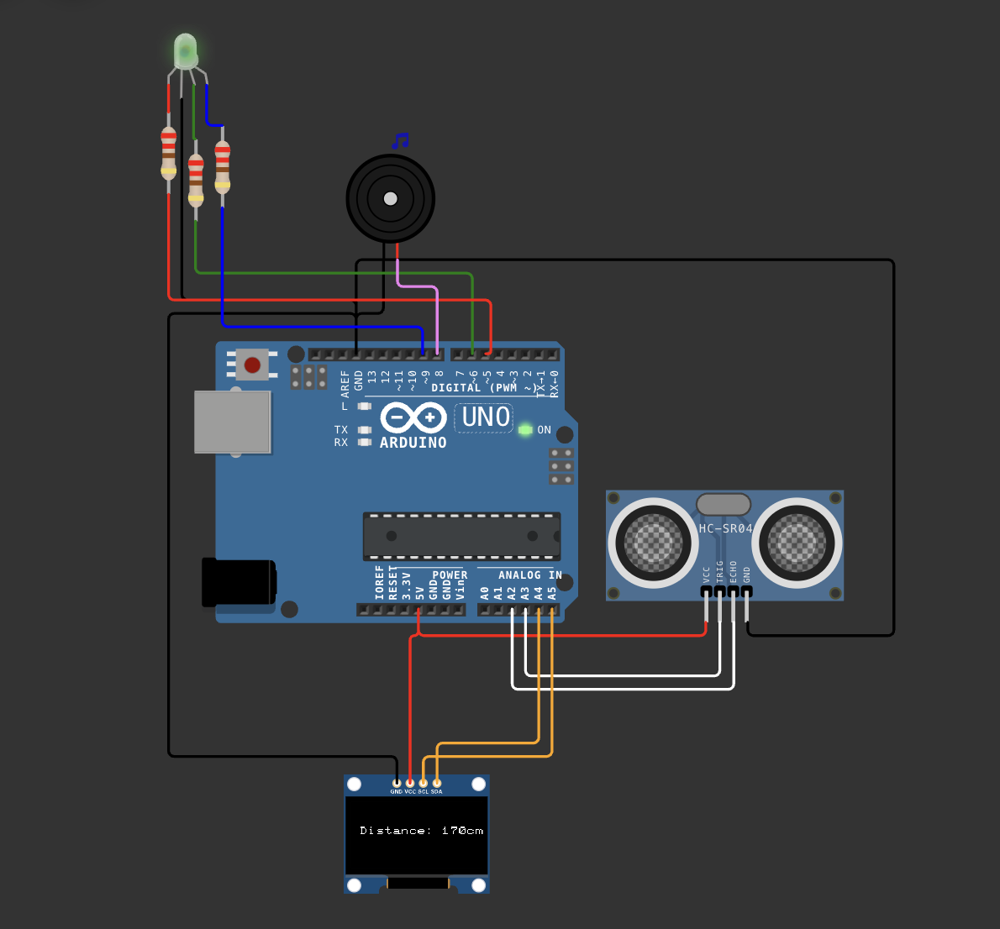

# 🚦 Arduino Distance Warning Device

A simple distance warning system built with Arduino, an ultrasonic sensor, RGB LED, buzzer, and OLED display.  
This project gives **visual and audio alerts** based on how close an object is.

This is my first Arduino project—made to delve deep into understanding embedded systems!

---

## Features

- 📏 Measures distance using HC-SR04 ultrasonic sensor
- 🖥️ Displays live distance on a 0.96" OLED screen
- 🌈 RGB LED changes color (blue → green → red) as distance decreases
- 🔊 Buzzer gives warning beeps when objects are close

---

## Hardware Used

- Arduino Uno
- HC-SR04 Ultrasonic Sensor
- Common-cathode RGB LED (with 220Ω resistors)
- Piezo Buzzer
- 0.96" OLED Display (I2C)
- jumper wires

---

## Circuit Diagram

---

## How it Works

1. The ultrasonic sensor measures the distance to nearby objects.
2. The OLED screen displays the distance in centimeters.
3. The RGB LED:
   - **Blue**: Object is far away.
   - **Green**: Object is at a medium distance.
   - **Red**: Object is too close.
4. The buzzer beeps more frequently as you get closer.

---

## Libraries Used

- [U8g2](https://github.com/olikraus/u8g2) for OLED display
- [pitches.h](https://www.arduino.cc/en/Tutorial/BuiltInExamples/toneMelody) for buzzer notes

Install these via the Arduino Library Manager.

---

## What I Learned

- Basics of Arduino programming
- Using sensors and actuators (ultrasonic, LED, buzzer)
- Simple wiring and electronics
- Displaying information on an OLED screen
-  **Timer conflicts on Arduino Uno:**  
  I learned that using the `tone()` function for the buzzer and `analogWrite()` for RGB LEDs on certain pins (specifically pins 3 and 11) can cause issues, because they share the same timer hardware inside the Arduino. To avoid glitches, I assigned my RGB LED pins to 5, 6, and 9, which use separate timers from the buzzer output.
- The importance of using resistors with LEDs to avoid damaging components.

---

project demonstration in Wokwi:
  -> [https://wokwi.com/projects/433297984977377281](Run_Demo)
